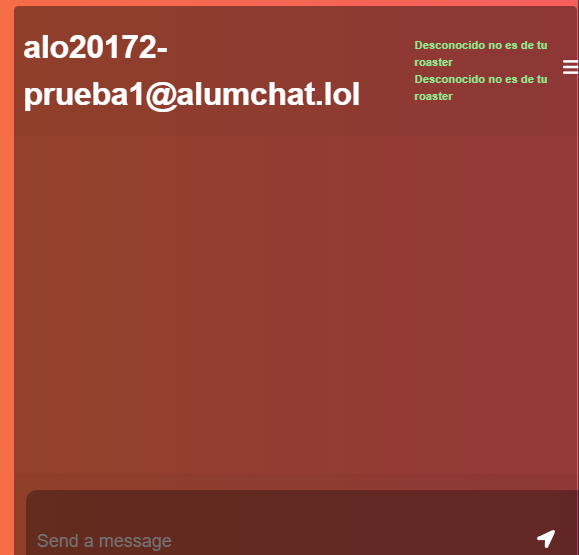

# PROYECT 1 NETWORKS-> CHAT

Diego Andrés Alonzo Medinilla   20172

## How to install?

1. Install git, docker && nodejs

Open a terminal and do this:

2. git clone [copy the link ssh or https]
3. cd networks-proyect1/Frontend
4. npm install -> It will install all dependencies in your laptop
5. docker compose up --build -> It will make the docker compose container and raise all the development stuff
6. go to localhost:3030/login

## How to use the client?
First of all the client connects to a server of alumchat.lol using XMPP protocol.

### Sign Up
the url for this is: localhost:3030/signUp
If you want to make a new client you have to enter just the username without the @alumchat.lol so just enter that and a password and you will get the capability of signing in. If you have a user already you can click log in to go to the loggin page. 

### Login
the url for this is: localhost:3030/login
When you log in, just have to enter the username with the @alumchat.lol, so it must be [username]@alumchat.lol and then your password. You also have the chance to sign up by clicking that.

### Chat
the url for this is: localhost:3030/chat but each time you loggout or there is like some error it will make you refreshing the page and moving to the localhost:3030/login to login again.

#### How to loggout
You just have to click in the loggout button and it will take you to the localhost:3030/login page and sign you out.

#### How to use the Delete Account
You just have to click the delete account button and it will throw you to the login page and if you try to enter again it will not allow you to enter.

#### How to use the Change Profile
Just click the button and it will take you to another page, you can cancel it in the cancel button, and you can change your status, change your status message. To change the status just click in the button and select an option can be: Online, Away, Do not Disturb, and Offline; then you just have to enter the new status message, the default is available; after changing them click on the change button.

#### How to use the Add Contact && Friend Requests
Just click on the button and it will show you some input field, you just have to enter the username you want to add to your roaster, and it will send a subscription request via xmpp after you click on the submit button that showed up, then the person will have to accept it or reject it depending on what they want and it will show up in the Friend request dropdown button.

In case you have any Friend Request it will show up in the Friend Request Dropdown and you have 2 mini buttons: the green one is to accept the request, and the red one is to reject the request to added it to your roaster.

### How to Chat?
To chat you got 2 options, you can enter directly the [username]@alumchat.lol and hit the submit button and it will take you a chat instance where you can chat, even if you don't got him in the roaster.

As you can see there are some buttons with the [username]@alumchat.lol, status, and status message and all those buttons are from your roaster. So you just enter and you can start chatting, it will show you messages and you can send messages entering the message and then hitting enter.
As you can see it will also show you the status and the status message

## Difficulties
During this proyect I encountered several problems, at first y tried to develop a Backend using express and nodejs, the issue with this is that it's unnecesary to do because it's a live chat app, not an application that awaits for a response like sending requests and fetching them. It needs listeners to be connected directly with the frontend, that's why at first aproach I did a docker compose because I was developing a backend but then I refactor all this to make an app to using contexts and listeners to handle the messages and all. Then another issue was to change @xmpp to Strophe.js because @xmpp was designed for backend so It didn't handle the listeners and all the stuff I wanted. Also Strophe is not that intuitive at first sight. 

## Conclusions
I didn't like this project, it's not my type to handle protocols and all these, even though it's okay to learn about all this things and have a multiple aproach to have a general learning.